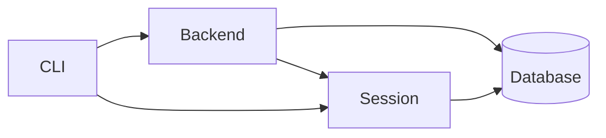

# auction_house_rs
Auction house simulator written in Rust

## Design

CLI is a client that communicates with the backend.

The backend communicates with the database. The backend's responsibility is to handle the business logic of the application.
The database is responsible for processing the auctions, funds and items deposited by the users.

The session is responsible for handling the user's session and authentication.
Generates a token that is used by the backend to authenticate the user.
The backend validates the token and uses the user's id to perform actions on the user's resources (e.g. funds, items, auctions).

The database keeps track of the auctions, funds and items deposited by the users. It also stores the user's credentials.

## Available CLI commands

**TODO** - not implemented yet

- `auction_house_cli --help` - Prints help information
- `auction_house_cli [--token <token>] <command>` - Calls the command with the given token,
if no token is given, the CLI will try to read the token from the `AUCTION_HOUSE_TOKEN` environment variable.
Some commands do not require a token, which is specified in the command's description.
  - `auction_house_cli user` - manage users
    - `auction_house_cli user register <username> <password>` - Register a new user
    - `auction_house_cli user login <username> <password>` - Login as a user and get a token, **token is ignored**
    - `auction_house_cli user logout` - Logout and invalidate the current token
    - `auction_house_cli user delete <username> <password>` - Delete the current user
    - `auction_house_cli user change_password <old_password> <new_password>` - Change the current user's password
    - `auction_house_cli user refresh_token` - Refresh the current user's token
  - `auction_house_cli funds` - manage funds
    - `auction_house_cli funds deposit <amount>` - Deposit funds into the auction house
    - `auction_house_cli funds withdraw <amount>` - Withdraw funds from the auction house
    - `auction_house_cli funds balance` - Get the current balance
  - `auction_house_cli items` - manage items
    - `auction_house_cli items list` - List all user's items
    - `auction_house_cli items deposit <item_id>` - Deposit an item into the auction house
    - `auction_house_cli items withdraw <item_id>` - Withdraw an item from the auction house
  - `auction_house_cli auctions` - manage auctions
    - `auction_house_cli auctions list` - List all auctions, **token is not required**
    - `auction_house_cli auctions list --watch` - Return a live feed of all auctions, **token is not required**  
    - `auction_house_cli auctions create <item> <starting_price> <duration>` - Create an auction
    - `auction_house_cli auctions bid <auction_id> <amount>` - Bid on an auction
    - `auction_house_cli auctions close <auction_id>` - Close an auction
    - `auction_house_cli auctions watch` - Watch user's auctions and get notifications about their results, **token is automatically refreshed, but it is not returned to the user**