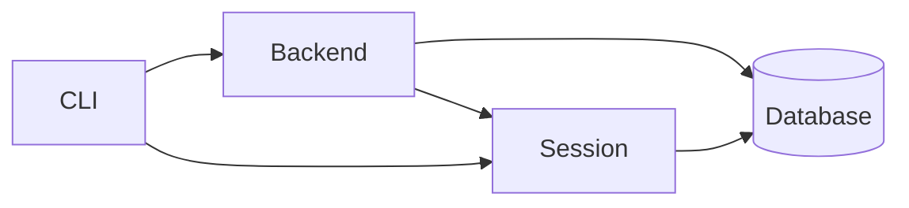

# auction_house_rs
Auction house simulator written in Rust

## Design

Purpose of this project is to learn Rust and to create a simple auction house simulator.
The design decisions and used technologies were not made to fit for real-life  application,
but rather for learning Rust and other stuff.

### Services



- **CLI**: 
  - communicates with the backend via gRPC to perform actions on the auction house,
  - communicates with the session via gRPC to perform actions on the user's session.
- **Backend**:
  - handles the business logic of the application,
  - receives requests from the CLI and communicates with the database to perform actions on the auction house,
  - communicates with the session to authenticate the user.
- **Session**:
  - handles the user's session,
  - receives requests from the CLI and returns the user's token,
  - verifies the user's token and returns the user's id to the backend.
- **Database**:
  - stores the auction house's state,
  - stores the user's credentials.

### Database

MongoDB is used as the database.

#### Databases
  - AuctionHouse
  - Session

##### AuctionHouse database collections:
  - Users
  - Auctions

##### Session database collections:
  - Credentials

#### Example Documents

##### Credentials collection

```json
{
  "_id": 123,
  "username": "username",
  "password": "password"
}
```

##### Users collection

```json
{
  "_id": 123,
  "username": "username",
  "balance": 1000,
  "items": [123, ...]
}
```

```json
{
  "_id": 123,
  "name": "some item"
}
```

##### Auctions collection

```json
{
  "_id": 7123,
  "item": "some item",
  "starting_price": 100,
  "current_price": 100,
  "start_time": "2021-01-01T00:00:00Z",
  "end_time": "2021-01-01T00:01:00Z",
  "bidder": "other_username",
  "owner_id": "username"
}
```

### Available CLI commands

**TODO** - not implemented yet

- `auction_house_cli --help` - Prints help information
- `auction_house_cli [--token <token>] <command>` - Calls the command with the given token,
if no token is given, the CLI will try to read the token from the `AUCTION_HOUSE_TOKEN` environment variable.
Some commands do not require a token, which is specified in the command's description.
  - `auction_house_cli user` - manage users
    - `auction_house_cli user register <username> <password>` - Register a new user
    - `auction_house_cli user login <username> <password>` - Login as a user and get a token, **token is ignored**
    - `auction_house_cli user logout` - Logout and invalidate the current token
    - `auction_house_cli user delete <username> <password>` - Delete the current user
    - `auction_house_cli user change-password <old_password> <new_password>` - Change the current user's password
    - `auction_house_cli user refresh-token` - Refresh the current user's token
  - `auction_house_cli funds` - manage funds
    - `auction_house_cli funds deposit <amount>` - Deposit funds into the auction house
    - `auction_house_cli funds withdraw <amount>` - Withdraw funds from the auction house
    - `auction_house_cli funds balance` - Get the current balance
  - `auction_house_cli items` - manage items
    - `auction_house_cli items list` - List all user's items
    - `auction_house_cli items deposit <item_id>` - Deposit an item into the auction house
    - `auction_house_cli items withdraw <item_id>` - Withdraw an item from the auction house
  - `auction_house_cli auctions` - manage auctions
    - `auction_house_cli auctions list` - List all auctions, **token is not required**
    - `auction_house_cli auctions list --watch` - Return a live feed of all auctions, **token is not required**  
    - `auction_house_cli auctions create <item> <starting_price> <duration>` - Create an auction
    - `auction_house_cli auctions bid <auction_id> <amount>` - Bid on an auction
    - `auction_house_cli auctions close <auction_id>` - Close an auction
    - `auction_house_cli auctions watch` - Watch user's auctions and get notifications about their results, **token is automatically refreshed, but it is not returned to the user**