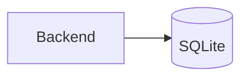

# The auction house

This project is a set of microservices that implements an auction house simulation
with a UI for the clients.

# Backend

TBD

```mermaid
flowchart LR
    B[Backend] --> DB[(SQLite)]
```

# Frontend

TBD